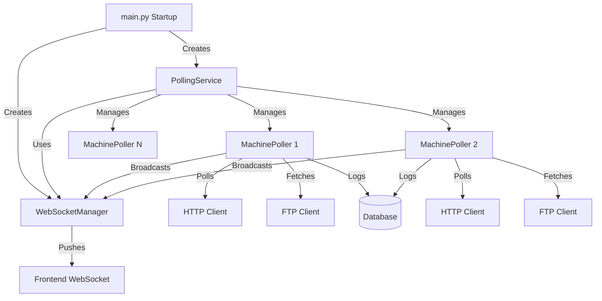
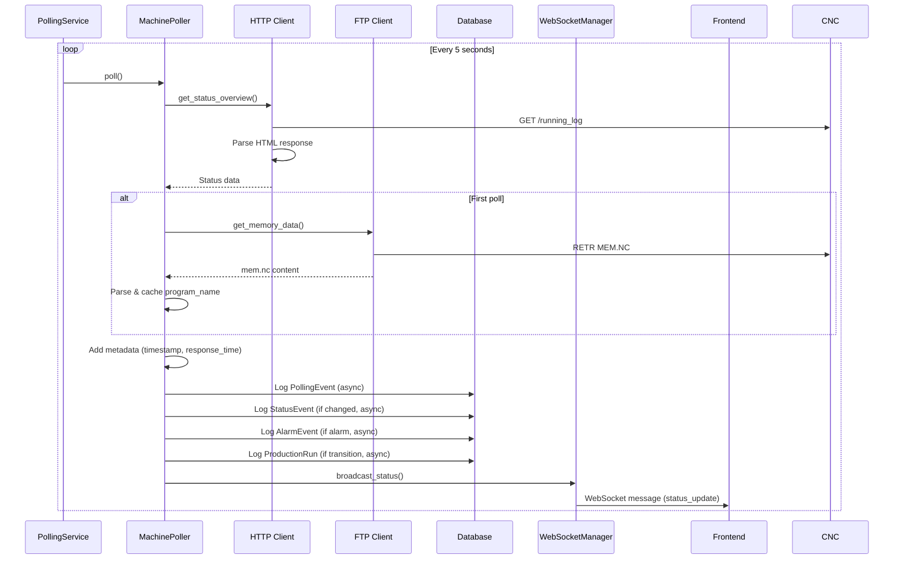

# Backend Architecture Research Plan

## Overview

This plan documents the research findings on:

1. Backend API endpoints and their data sources
2. How the backend accesses data from CNC machines (HTTP and FTP)
3. The polling service architecture and data flow

## Key Findings

### 1. Backend Endpoints Structure

The backend exposes REST API endpoints organized by domain:

**Machine Management** (`/api/machines/*`):

- `GET /api/machines/` - List all machines
- `GET /api/machines/{machine_id}` - Get machine details
- `POST /api/machines/` - Create new machine
- `PUT /api/machines/{machine_id}` - Update machine config
- `DELETE /api/machines/{machine_id}` - Delete machine
- `POST /api/machines/{machine_id}/test` - Test HTTP/FTP connections
- `POST /api/machines/{machine_id}/refresh-program-name` - Manually refresh program name from mem.nc

**Machine Status** (`/api/machines/{machine_id}/*`):

- `GET /api/machines/{machine_id}/status` - Comprehensive real-time status
- `GET /api/machines/{machine_id}/running-log` - Running log data
- `GET /api/machines/{machine_id}/counters` - Workpiece counters
- `GET /api/machines/{machine_id}/alarms` - Alarm log
- `GET /api/machines/{machine_id}/tools` - Tool data (ATC or tool table)
- `GET /api/machines/{machine_id}/position` - Work offsets from POSNI1.NC
- `GET /api/machines/{machine_id}/programs` - List files via FTP
- `GET /api/machines/{machine_id}/download` - Download file via FTP
- `POST /api/machines/{machine_id}/upload` - Upload file via FTP

**Summary Endpoints** (`/api/summary/*`):

- `GET /api/summary/running` - Running summary with production run data
- `GET /api/summary/online` - Online machines summary (deprecated)
- `GET /api/summary/offline` - Offline machines summary (deprecated)
- `GET /api/summary/machines` - Unified machine status summary

**WebSocket** (`/api/ws`):

- Real-time status updates pushed to connected clients

### 2. CNC Machine Data Access

The backend uses two protocols to access CNC machine data:

#### HTTP Client (`CNCHttpClient`)

Located in `backend/app/clients/http_client.py`

**Protocol Details**:

- Uses raw socket connections (not standard HTTP library)
- Sends HTTP/1.0 requests (CNC doesn't handle HTTP/1.1 properly)
- Timeout: 5 seconds default
- Port: Configurable per machine (default 80)

**Endpoints Accessed**:

- `/running_log` - Program name, cycle time, cutting time, power on hours
- `/work_counter` - Workpiece counter data (4 counters)
- `/alarm_log` - Active alarms with severity levels
- `/tool` - ATC (Automatic Tool Changer) tool table data

**Data Parsing**:

- HTML parsing using regex patterns
- Extracts structured data from Brother CNC HTML responses
- Handles various HTML formats and edge cases

#### FTP Client (`CNCFtpClient`)

Located in `backend/app/clients/ftp_client.py`

**Protocol Details**:

- Uses Python `ftplib` with passive mode
- Port: Configurable per machine (default 21)
- Username/Password: Configurable per machine
- Handles rate limiting (421 errors) with exponential backoff

**Files Accessed**:

- `MEM.NC` - Memory data (contains active program name)
- `TOLNI1.NC` - Tool table file
- `POSNI1.NC` - Position/work offsets
- `ALARM.NC` - Alarm data
- `MONTR.NC` - Monitor data
- Program files (e.g., `O2000.NC`)

**Operations**:

- `list_files()` - List directory contents
- `download_file()` - Download file from machine
- `upload_file()` - Upload file to machine
- `delete_file()` - Delete file from machine
- `get_memory_data()` - Get MEM.NC content
- `get_tool_table_data()` - Get TOLNI1.NC content

### 3. Polling Service Architecture

Located in `backend/app/services/polling.py`

#### Architecture Overview



#### PollingService Class

**Responsibilities**:

- Manages lifecycle of all machine pollers
- Runs main polling loop (every 5 seconds)
- Polls all enabled machines concurrently
- Updates pollers when machines are added/removed/updated

**Key Methods**:

- `start()` - Start polling service
- `stop()` - Stop polling service
- `_poll_loop()` - Main async loop
- `_poll_all_machines()` - Poll all machines concurrently
- `get_machine_status()` - Get status for specific machine

#### MachinePoller Class

**Responsibilities**:

- Polls a single machine
- Fetches program_name from mem.nc via FTP (on first poll, then cached)
- Logs events to database (non-blocking)
- Tracks online/offline status
- Handles consecutive failures (3 failures = offline)

**Polling Flow**:

1. Create HTTP client for machine
2. Call `get_status_overview()` which:

   - Fetches `/running_log` (critical - if fails, machine unreachable)
   - Optionally fetches `/work_counter`, `/alarm_log`, `/tool`

3. Fetch program_name from mem.nc via FTP (first poll only, then cached)
4. Calculate response time
5. Log polling event to database
6. Log status transitions, alarms, production runs
7. Broadcast status via WebSocket

**Event Logging**:

- `PollingEvent` - Every poll (success/failure with response time)
- `MachineStatusEvent` - Status transitions (running → stopped, etc.)
- `AlarmEvent` - New alarms (only when status == 'alarm')
- `ProductionRun` - Production run start/end tracking

**Caching Strategy**:

- `program_name` fetched from mem.nc on first poll, then cached
- Cache preserved even when machine goes offline
- Can be manually refreshed via `/api/machines/{id}/refresh-program-name`

### 4. Data Flow



### 5. Key Components

**Backend Files**:

- `backend/app/main.py` - Application entrypoint, service initialization
- `backend/app/services/polling.py` - Polling service implementation
- `backend/app/services/websocket.py` - WebSocket manager
- `backend/app/clients/http_client.py` - HTTP client for CNC machines
- `backend/app/clients/ftp_client.py` - FTP client for CNC machines
- `backend/app/api/status.py` - Status endpoints
- `backend/app/api/machines.py` - Machine management endpoints
- `backend/app/api/summary.py` - Summary endpoints
- `backend/app/api/websocket.py` - WebSocket endpoint

**Frontend Files**:

- `frontend/src/config/api.ts` - API configuration
- `frontend/src/api/machines.ts` - Machine API calls
- `frontend/src/api/summary.ts` - Summary API calls
- `frontend/src/contexts/WebSocketContext.tsx` - WebSocket context
- `frontend/src/hooks/useWebSocket.ts` - WebSocket hook

### 6. Important Details

**Polling Interval**: 5 seconds (hardcoded in `_poll_loop()`)

**Offline Detection**:

- Requires 3 consecutive failures before marking offline
- Offline status logged to database only after threshold

**Program Name Source**:

- Primary: `MEM.NC` file via FTP (most reliable)
- Fallback: HTTP `/running_log` endpoint (less reliable)
- Cached after first fetch to reduce FTP load

**Concurrent Polling**:

- All machines polled concurrently using `asyncio.gather()`
- Each machine has independent poller instance
- Failures don't block other machines

**Database Events**:

- All event logging is non-blocking (uses `asyncio.create_task()`)
- Events logged: PollingEvent, MachineStatusEvent, AlarmEvent, ProductionRun
- Events used for summary endpoints and historical analysis

**WebSocket Updates**:

- Status broadcast after each poll
- Initial status sent to new connections
- Cached status available for API queries

### 7. Telnet Protocol (Port 10000) - Future Transition

**Overview**:

The Brother CNC machines support Protocol Type 2 over TCP/IP port 10000, which provides:

- Direct data file reading (same format as FTP files)
- Write operations (tool offsets, tool life, ATC configuration)
- Macro variable access
- More reliable than HTTP/FTP for data reads

**Protocol Format**:

```
Command Frame: %C[Command(7)][Arguments(8)]  \r\n[Checksum]%\r\n
Response: %R[Command(7)][Arguments(8)][Status(2)]\n[Data]\n[Checksum]%\n
```

**Key Commands**:

- `LOD [filename] `- Load data file (e.g., `LOD MEM`, `LOD ATCTL`, `LOD POSNI1`)
- `REDTOFS` - Read tool offset
- `WRTTOFS` - Write tool offset
- `REDTLLF` - Read tool life
- `WRTTLLF` - Write tool life
- `CHGMAGM` - Change ATC tool assignment
- `IOCREF` - Read I/O signal
- `IOCMOD` - Write I/O signal

**Available Data Files via LOD**:

- `MEM` - Memory/program information (same as MEM.NC via FTP)
- `ATCTL` - ATC magazine configuration
- `POSNI1`, `POSNI2`, etc. - Position/work offsets (same as POSNI1.NC via FTP)
- `TOLNI1` - Tool table (same as TOLNI1.NC via FTP)
- `SYSC89`, `SYSC94-99` - System data files
- `PRD1`, `PRD2`, `PRD3` - Production data
- `PANEL` - Panel status
- `IO` - I/O status
- `DIR` - Directory listing

**Machine Model Detection**:

- Machine model can be determined by:

  1. Available file names via `LOD DIR` or directory listing
  2. System data files (SYSC89, SYSC94-99) contain model information
  3. File format differences between models (e.g., Speedio vs. other models)

- Different models have different:
  - File naming conventions
  - Data field positions in files
  - Supported file types
  - Schema formats

**Units Detection (Macro Variable #302)**:

- Macro variable #302 indicates unit system:
  - Value 0 = Metric (mm)
  - Value 1 = Imperial (inch)
- Reading method (to be implemented):
  - Use macro variable read command (format TBD)
  - Or read from system data file that contains unit setting
- Critical for correct parsing:
  - Position values (POSNI files)
  - Tool offsets (TOLNI files)
  - All dimensional data must be interpreted in correct units

**Schema Differences by Model**:

- **Speedio Models**: Specific file formats and field positions
- **Other Brother Models**: May have different:
  - Field delimiters
  - Field order
  - Data precision
  - Optional fields
- **Systematic Schema Definition Needed**:

  1. Read machine model from available files
  2. Load sample data files for each model
  3. Document field positions and formats
  4. Create model-specific parsers
  5. Validate against known good data

**Transition Plan**:

1. **Phase 1: Add Telnet Client**

   - Create `CNCTelnetClient` class (similar to `CNCHttpClient` and `CNCFtpClient`)
   - Implement connection management (port 10000)
   - Implement `LOD` command for reading data files
   - Implement basic command/response handling

2. **Phase 2: Machine Model Detection**

   - Implement model detection from available files
   - Create model registry/database
   - Store model info per machine in database

3. **Phase 3: Units Detection**

   - Implement macro variable #302 reading
   - Store units per machine
   - Use units for all data parsing

3.5. **Phase 3.5: Build Cursor Skills for Schema Definition Workflow**

This phase creates reusable Cursor skills/workflows that enable reliable, repeatable schema definition for each data file type. This workflow will be used repeatedly for each new data source (TOLNn, POSNn, MEM, etc.).

**Workflow Steps** (to be codified as Cursor skills):

   1. **Schema Input from User**:

      - User provides schema specification for data source (e.g., TOLNn, POSNn)
      - Schema includes:
        - Control version variants (a/b/c/d control)
        - Unit type handling (inch/metric):
          - Whether units are embedded in file content
          - Whether filename changes per unit type (e.g., TOLNI1 vs TOLNM1)
        - Field definitions:
          - Field names
          - Field positions/offsets
          - Data types (int, float, string)
          - Field delimiters
          - Optional vs required fields
        - Line format specifications
        - Header/footer handling (if any)

   1. **Schema Registry Creation**:

      - Create schema definition file (e.g., `backend/app/schemas/cnc_data/tolni_schema.py`)
      - Store schema per control version
      - Store unit type handling metadata
      - Document field mappings and validation rules

   1. **Parser Implementation**:

      - Create parser class for data type (e.g., `TolniParser`)
      - Implement control version detection logic
      - Implement unit type detection/handling:
        - If units in file: parse and apply unit conversion if needed
        - If filename-based: select correct filename based on machine units
      - Implement field extraction based on schema
      - Add validation for required fields
      - Handle optional fields gracefully

   1. **Parser Testing**:

      - Create test file with sample data for each control version
      - Test with both metric and imperial units (if applicable)
      - Validate field extraction accuracy
      - Test edge cases (empty fields, missing data, malformed lines)
      - Compare output with known good data
      - Document test results

   1. **Endpoint Integration**:

      - Identify existing endpoints using this data source
      - Update endpoints to use new parser
      - Maintain backward compatibility where possible
      - Update response schemas to match new data structure
      - Add unit information to responses (if applicable)
      - Update API documentation

   1. **Validation & Verification**:

      - Test with real machine data
      - Compare results with previous parsing (if replacing)
      - Verify unit conversions are correct
      - Check performance impact
      - Document any breaking changes

**Cursor Skills to Create**:

   - **Skill: Parse Schema Specification**
     - Input: User-provided schema document/specification
     - Output: Structured schema definition in code
     - Validates schema completeness
     - Generates parser skeleton

   - **Skill: Generate Parser from Schema**
     - Input: Schema definition
     - Output: Parser class with control version handling
     - Generates field extraction logic
     - Implements unit type handling
     - Adds error handling

   - **Skill: Create Parser Tests**
     - Input: Parser class + sample data
     - Output: Comprehensive test suite
     - Generates test cases for each control version
     - Tests unit type variations
     - Validates field extraction

   - **Skill: Update Endpoints with New Parser**
     - Input: Parser class + endpoint list
     - Output: Updated endpoints using new parser
     - Maintains API compatibility
     - Updates response schemas
     - Adds unit information

**Deliverables**:

   - Cursor skill definitions (`.cursorrules` or skill files)
   - Schema registry structure (`backend/app/schemas/cnc_data/`)
   - Parser base class/template
   - Test template for parsers
   - Documentation template for schema definitions
   - Example: First schema definition (TOLNn) as reference

**Success Criteria**:

   - Can reliably add new data source schema in < 30 minutes
   - Parser tests catch schema mismatches
   - Unit handling works correctly for both metric/imperial
   - Control version detection is accurate
   - Endpoints updated without breaking changes

4. **Phase 4: Schema Definition**

   - Use Cursor skills from Phase 3.5 to systematically define schemas
   - For each data file type (TOLNn, POSNn, MEM, ATCTL, etc.):
     - User provides schema specification
     - Generate parser using Cursor skills
     - Test parser with sample data
     - Update endpoints to use new parser
   - Create schema registry with all defined schemas
   - Document schema variations by control version

5. **Phase 5: Replace HTTP/FTP Reads**

   - Replace HTTP reads with telnet LOD commands
   - Replace FTP reads with telnet LOD commands
   - Keep FTP for file transfers (upload/download)
   - Update polling service to use telnet client

6. **Phase 6: Enable Writes**

   - Implement write operations (tool offsets, tool life, ATC)
   - Add write endpoints to API
   - Add safety checks and validation

**Benefits of Telnet Protocol**:

- Same data format as FTP (no parsing changes needed)
- More reliable than HTTP (no HTML parsing)
- Enables write operations
- Single protocol for all data operations
- Better error handling (status codes)
- Lower latency (direct TCP connection)

**Current State**:

- HTTP client: Used for `/running_log`, `/work_counter`, `/alarm_log`, `/tool`
- FTP client: Used for `MEM.NC`, `TOLNI1.NC`, `POSNI1.NC`, file transfers
- Telnet client: Not yet implemented in backend (exists in `brother_cnc_export/`)

**Files to Review**:

- `brother_cnc_export/brother_cnc_client.py` - Reference implementation
- `brother_cnc_export/PROTOCOL_EXAMPLES.md` - Protocol frame examples
- `brother_cnc_export/PROTOCOL_DISCOVERY.md` - Protocol discovery notes