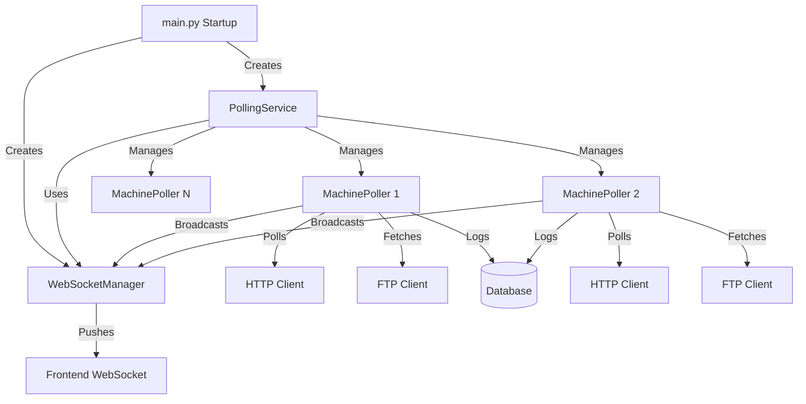
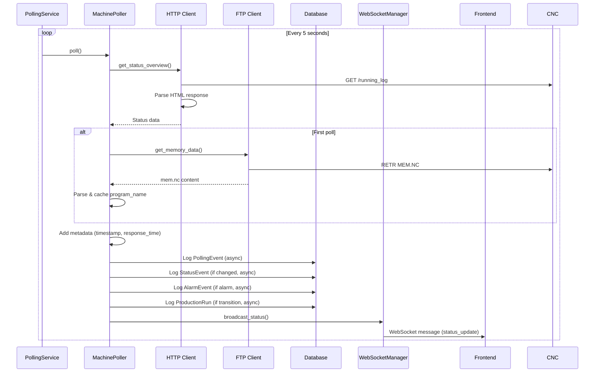

# Backend Architecture Research Plan

## Overview

This plan documents the research findings on:

1. Backend API endpoints and their data sources
2. How the backend accesses data from CNC machines (HTTP and FTP)
3. The polling service architecture and data flow

## Key Findings

### 1. Backend Endpoints Structure

The backend exposes REST API endpoints organized by domain:

**Machine Management** (`/api/machines/*`):

- `GET /api/machines/` - List all machines
- `GET /api/machines/{machine_id}` - Get machine details
- `POST /api/machines/` - Create new machine
- `PUT /api/machines/{machine_id}` - Update machine config
- `DELETE /api/machines/{machine_id}` - Delete machine
- `POST /api/machines/{machine_id}/test` - Test HTTP/FTP connections
- `POST /api/machines/{machine_id}/refresh-program-name` - Manually refresh program name from mem.nc

**Machine Status** (`/api/machines/{machine_id}/*`):

- `GET /api/machines/{machine_id}/status` - Comprehensive real-time status
- `GET /api/machines/{machine_id}/running-log` - Running log data
- `GET /api/machines/{machine_id}/counters` - Workpiece counters
- `GET /api/machines/{machine_id}/alarms` - Alarm log
- `GET /api/machines/{machine_id}/tools` - Tool data (ATC or tool table)
- `GET /api/machines/{machine_id}/position` - Work offsets from POSNI1.NC
- `GET /api/machines/{machine_id}/programs` - List files via FTP
- `GET /api/machines/{machine_id}/download` - Download file via FTP
- `POST /api/machines/{machine_id}/upload` - Upload file via FTP

**Summary Endpoints** (`/api/summary/*`):

- `GET /api/summary/running` - Running summary with production run data
- `GET /api/summary/online` - Online machines summary (deprecated)
- `GET /api/summary/offline` - Offline machines summary (deprecated)
- `GET /api/summary/machines` - Unified machine status summary

**WebSocket** (`/api/ws`):

- Real-time status updates pushed to connected clients

### 2. CNC Machine Data Access

The backend uses two protocols to access CNC machine data:

#### HTTP Client (`CNCHttpClient`)

Located in `backend/app/clients/http_client.py`

**Protocol Details**:

- Uses raw socket connections (not standard HTTP library)
- Sends HTTP/1.0 requests (CNC doesn't handle HTTP/1.1 properly)
- Timeout: 5 seconds default
- Port: Configurable per machine (default 80)

**Endpoints Accessed**:

- `/running_log` - Program name, cycle time, cutting time, power on hours (deprecated - replaced by MONTR)
- `/work_counter` - Workpiece counter data (4 counters) (deprecated - replaced by MONTR)
- `/alarm_log` - Active alarms with severity levels
- `/tool` - ATC (Automatic Tool Changer) tool table data (deprecated - replaced by ATCTL via Telnet)

**Data Parsing**:

- HTML parsing using regex patterns
- Extracts structured data from Brother CNC HTML responses
- Handles various HTML formats and edge cases

#### FTP Client (`CNCFtpClient`)

Located in `backend/app/clients/ftp_client.py`

**Protocol Details**:

- Uses Python `ftplib` with passive mode
- Port: Configurable per machine (default 21)
- Username/Password: Configurable per machine
- Handles rate limiting (421 errors) with exponential backoff

**Files Accessed**:

- `MEM.NC` - Memory data (contains active program name)
- `TOLNI1.NC` - Tool table file
- `POSNI1.NC` - Position/work offsets
- `ALARM.NC` - Alarm data
- `MONTR.NC` - Monitor data (provides running log, time data, and workpiece counters)
- Program files (e.g., `O2000.NC`)

**Operations**:

- `list_files()` - List directory contents
- `download_file()` - Download file from machine
- `upload_file()` - Upload file to machine
- `delete_file()` - Delete file from machine
- `get_memory_data()` - Get MEM.NC content
- `get_tool_table_data()` - Get TOLNI1.NC content

### 3. Polling Service Architecture

Located in `backend/app/services/polling.py`

#### Architecture Overview



#### PollingService Class

**Responsibilities**:

- Manages lifecycle of all machine pollers
- Runs main polling loop (every 5 seconds)
- Polls all enabled machines concurrently
- Updates pollers when machines are added/removed/updated

**Key Methods**:

- `start()` - Start polling service
- `stop()` - Stop polling service
- `_poll_loop()` - Main async loop
- `_poll_all_machines()` - Poll all machines concurrently
- `get_machine_status()` - Get status for specific machine

#### MachinePoller Class

**Responsibilities**:

- Polls a single machine
- Fetches program_name from mem.nc via FTP (on first poll, then cached)
- Logs events to database (non-blocking)
- Tracks online/offline status
- Handles consecutive failures (3 failures = offline)

**Polling Flow**:

1. Create HTTP client for machine
2. Call `get_status_overview()` which:

   - Fetches MONTR via Telnet (critical - if fails, machine unreachable)
   - Optionally fetches `/alarm_log` via HTTP (not yet migrated to Telnet)

3. Fetch program_name from mem.nc via FTP (first poll only, then cached)
4. Calculate response time
5. Log polling event to database
6. Log status transitions, alarms, production runs
7. Broadcast status via WebSocket

**Event Logging**:

- `PollingEvent` - Every poll (success/failure with response time)
- `MachineStatusEvent` - Status transitions (running → stopped, etc.)
- `AlarmEvent` - New alarms (only when status == 'alarm')
- `ProductionRun` - Production run start/end tracking

**Caching Strategy**:

- `program_name` fetched from mem.nc on first poll, then cached
- Cache preserved even when machine goes offline
- Can be manually refreshed via `/api/machines/{id}/refresh-program-name`

### 4. Data Flow



### 5. Key Components

**Backend Files**:

- `backend/app/main.py` - Application entrypoint, service initialization
- `backend/app/services/polling.py` - Polling service implementation
- `backend/app/services/websocket.py` - WebSocket manager
- `backend/app/clients/http_client.py` - HTTP client for CNC machines
- `backend/app/clients/ftp_client.py` - FTP client for CNC machines
- `backend/app/api/status.py` - Status endpoints
- `backend/app/api/machines.py` - Machine management endpoints
- `backend/app/api/summary.py` - Summary endpoints
- `backend/app/api/websocket.py` - WebSocket endpoint

**Frontend Files**:

- `frontend/src/config/api.ts` - API configuration
- `frontend/src/api/machines.ts` - Machine API calls
- `frontend/src/api/summary.ts` - Summary API calls
- `frontend/src/contexts/WebSocketContext.tsx` - WebSocket context
- `frontend/src/hooks/useWebSocket.ts` - WebSocket hook

### 6. Important Details

**Polling Interval**: 5 seconds (hardcoded in `_poll_loop()`)

**Offline Detection**:

- Requires 3 consecutive failures before marking offline
- Offline status logged to database only after threshold

**Program Name Source**:

- Primary: `MONTR.NC` file via Telnet (most reliable - provides operation_program_no)
- Secondary: `MEM.NC` file via Telnet (also provides program_name)
- Deprecated: HTTP `/running_log` endpoint (replaced by MONTR)
- Cached after first fetch to reduce load

**Concurrent Polling**:

- All machines polled concurrently using `asyncio.gather()`
- Each machine has independent poller instance
- Failures don't block other machines

**Database Events**:

- All event logging is non-blocking (uses `asyncio.create_task()`)
- Events logged: PollingEvent, MachineStatusEvent, AlarmEvent, ProductionRun
- Events used for summary endpoints and historical analysis

**WebSocket Updates**:

- Status broadcast after each poll
- Initial status sent to new connections
- Cached status available for API queries

### 7. Telnet Protocol (Port 10000) - Future Transition

**Overview**:

The Brother CNC machines support Protocol Type 2 over TCP/IP port 10000, which provides:

- Direct data file reading (same format as FTP files)
- Write operations (tool offsets, tool life, ATC configuration)
- Macro variable access
- More reliable than HTTP/FTP for data reads

**Protocol Format**:

```
Command Frame: %C[Command(7)][Arguments(8)]  \r\n[Checksum]%\r\n
Response: %R[Command(7)][Arguments(8)][Status(2)]\n[Data]\n[Checksum]%\n
```

**Key Commands**:

- `LOD [filename] `- Load data file (e.g., `LOD MEM`, `LOD ATCTL`, `LOD POSNI1`)
- `REDTOFS` - Read tool offset
- `WRTTOFS` - Write tool offset
- `REDTLLF` - Read tool life
- `WRTTLLF` - Write tool life
- `CHGMAGM` - Change ATC tool assignment
- `IOCREF` - Read I/O signal
- `IOCMOD` - Write I/O signal

**Available Data Files via LOD**:

- `MEM` - Memory/program information (same as MEM.NC via FTP)
- `ATCTL` - ATC magazine configuration
- `POSNI1`, `POSNI2`, etc. - Position/work offsets (same as POSNI1.NC via FTP)
- `TOLNI1` - Tool table (same as TOLNI1.NC via FTP)
- `MONTR` - Machine monitor data (replaces HTTP `/running_log` and `/work_counter`)
- `SYSC89`, `SYSC94-99` - System data files
- `PRD1`, `PRD2`, `PRD3` - Production data
- `PANEL` - Panel status
- `IO` - I/O status
- `DRQALL` - Directory listing (not `LOD DIR` - that command doesn't exist in protocol)
- **Note**: `WKCNTR` is not needed - workpiece counters are provided by MONTR (C01-C04 lines)
- `ALARM` - Current alarm data (E01-E36, L01-L18)

**Machine Model Detection**:

- Machine model can be determined by:

  1. Available file names via `DRQALL` directory listing
  2. System data files (SYSC89, SYSC94-99) contain model information
  3. File format differences between models (e.g., Speedio vs. other models)

- Different models have different:
  - File naming conventions
  - Data field positions in files
  - Supported file types
  - Schema formats

**Units Detection (Macro Variable #302)**:

- Macro variable #302 indicates unit system:
  - Value 0 = Metric (mm)
  - Value 1 = Imperial (inch)
- Reading method (to be implemented):
  - Use macro variable read command (format TBD)
  - Or read from system data file that contains unit setting
- Critical for correct parsing:
  - Position values (POSNI files)
  - Tool offsets (TOLNI files)
  - All dimensional data must be interpreted in correct units

**Schema Differences by Model**:

- **Speedio Models**: Specific file formats and field positions
- **Other Brother Models**: May have different:
  - Field delimiters
  - Field order
  - Data precision
  - Optional fields
- **Systematic Schema Definition Needed**:

  1. Read machine model from available files
  2. Load sample data files for each model
  3. Document field positions and formats
  4. Create model-specific parsers
  5. Validate against known good data

**Transition Plan**:

1. **Phase 1: Add Telnet Client**

   **Status**: ✅ **COMPLETE** - Telnet client implemented and tested with real machines.

   **Completed Work**:

   - ✅ Created `CNCTelnetClient` class in `backend/app/clients/telnet_client.py`
     - Async/await compatible for integration with polling service
     - Similar interface to `CNCHttpClient` and `CNCFtpClient`
   - ✅ Implemented connection management (port 10000, TCP/IP)
     - `connect()` / `disconnect()` methods
     - Connection state tracking
     - Context manager support (`async with`)
   - ✅ Implemented `LOD` command for reading data files
     - Generic `load_data(data_name)` method
     - Convenience methods: `get_memory_data()`, `get_tool_table_data()`, `get_position_data()`, `get_atc_magazine_data()`
     - Supports: MEM, TOLNI1, POSNI1, ATCTL, and any other data name
   - ✅ Implemented basic command/response handling
     - Command frame building with checksum calculation
     - Response parsing with status code extraction
     - 47 completion codes documented and interpreted
     - Rate limiting (0.2s default command delay)
   - ✅ Additional commands implemented:
     - `REDPRGN` - Get currently executed program information (replaces HTTP `/running_log` parsing)
     - `REDPRG` - Get program content by character count
     - `DRQALL` - Request directory listing (replaces FTP directory listing)
     - `parse_directory_listing()` - Parser for DRQALL response (11-byte format: 8-byte name + 3-byte size)

   **Implementation Details**:

   - **Connection Management**: Per-request connections (connects on demand, disconnects after operation)
   - **Async Compatibility**: All methods are async/await, fully compatible with `asyncio` polling service
   - **Error Handling**: Status code interpretation, connection timeout handling, graceful error returns
   - **Rate Limiting**: Configurable `command_delay` (default 0.2s), enforced between all commands
   - **Connection Lifecycle**: Connections are created per-operation, not persistent (can be optimized later)

   **Files Created/Modified**:

   - `backend/app/clients/telnet_client.py` - Main telnet client implementation
   - `backend/app/clients/__init__.py` - Exports `CNCTelnetClient`
   - `backend/scripts/test_telnet.py` - Basic connection and data loading tests
   - `backend/scripts/test_program_info.py` - REDPRGN and REDPRG command tests
   - `backend/scripts/test_drqall.py` - DRQALL directory listing tests

   **Testing**:

   - ✅ Connection tested with real machine (192.168.1.100)
   - ✅ LOD commands tested (MEM, TOLNI1, POSNI1, ATCTL)
   - ✅ REDPRGN tested (program information retrieval)
   - ✅ REDPRG tested (program content retrieval)
   - ✅ DRQALL tested (directory listing with 67 files parsed correctly in C00 format)
   - ✅ All RED commands implemented and ready for testing

   **Remaining Open Questions** (for future optimization):

   - **Connection pooling**: Current implementation uses per-request connections. Could optimize with connection pooling for high-frequency polling, but current approach is simpler and works well.
   - **Persistent connections**: Could maintain persistent connections per machine for better performance, but requires connection lifecycle management and reconnection logic.
   - **Configurable rate limiting**: Currently hardcoded to 0.2s. Could make configurable per-machine if needed.

2. **Phase 2: Machine Model Detection** ✅ **COMPLETE**

   - ✅ Implemented control type detection (C00 vs D00)
   - Detection method: Check directory listing for PRDC# (C00) or PRDD# (D00) files
   - Method: `detect_control_type()` in `CNCTelnetClient`
   - Uses existing `get_directory_listing()` and `parse_directory_listing()` methods

   **Implementation Details**:

   - **Detection Method**: Uses `DRQALL` command to get directory listing, then searches for multiple file patterns:
     - C00 control indicators: `PRDC#` files (e.g., PRDC1, PRDC89) and `SYSC#` files (e.g., SYSC89, SYSC94)
     - D00 control indicators: `PRDD#` files (e.g., PRDD1, PRDD89) and `SYSD#` files (e.g., SYSD89, SYSD94)
   - **Confidence Levels**:
     - High: 2+ matching indicators found in correct format
     - Medium: 1 matching indicator found in correct format
     - Low: Fallback to format with more valid entries (when no indicators found)
   - **Scoring System**: Uses `(matching_indicators - opposing_indicators)` to determine control type
   - **Fallback**: If no indicators found, uses format that produces more valid entries
   - **Edge Cases**: Handles ambiguous cases by preferring format with higher score
   - **DRQALL Format Verification**: ⚠️ **CORRECTED**: DRQALL uses different formats for C00 vs D00 controls:
     - **C00 control**: 11-byte entries (8-byte name + 3-byte size in blocks)
     - **D00 control**: 18-byte entries (8-byte name + 10-byte size in bytes)
     - **Catch-22 Solution**: `detect_control_type()` solves the circular dependency by parsing in BOTH formats simultaneously and checking which format produces PRDC#/PRDD# indicators
     - Updated `parse_directory_listing()` to support both formats with auto-detection
     - Can also specify `control_type` parameter to force a specific format (for efficiency after detection)
     - See `docs/DRQALL_CONTROL_VERIFICATION.md` for details

   **Files Created/Modified**:

   - `backend/app/clients/telnet_client.py` - Added `detect_control_type()` method and enhanced `parse_directory_listing()` with dual-format support
   - `backend/scripts/test_control_detection.py` - Test script for control detection
   - `docs/DRQALL_CONTROL_VERIFICATION.md` - Documentation of format differences and catch-22 solution

   **Testing**:

   - ✅ Tested on real machine (192.168.1.100) - Detected as C00 control
   - ✅ Found 8 C00 indicators (7 SYSC files + 1 PRDC file) with high confidence
   - ✅ Verified catch-22 solution works correctly (parses both formats simultaneously)

   **Remaining Open Questions** (for future integration):

   - **Database storage**: Should control type be added to `Machine` model? New field or use existing `model` field?
   - **Integration**: When should control type be detected? On machine registration? Periodic re-detection?
   - **Validation**: Should we verify detected control type against other indicators (SYSC/SYSD files)?

3. **Phase 3: Units Implementation** ✅ **IN PROGRESS**

   **Status**: Manual unit selection implemented, parser/display integration in progress
   
   **Completed**:
   - ✅ Manual unit selection in machine setup UI (`units` field in Machine model)
   - ✅ Database schema: `units` column added to `machines` table (migration `09-add-units-column.sql`)
   - ✅ Backend API: `units` field in create/update schemas
   - ✅ Frontend UI: Unit selector in add/edit machine forms

   **Status**: ✅ **COMPLETE**

   **Completed Tasks**:
   - ✅ Use units in parsers: Updated parsers (TOLNI, POSNI, HTTP tool parser) to accept and include units
   - ✅ Display units in UI: Updated UI components to show correct unit suffix based on machine units
   - ✅ Unit conversion logic: Implemented conversion utilities for display/validation
   - ✅ API endpoints: All endpoints pass units to parsers and include units in responses
   - ✅ Frontend formatting: Created `formatDimension` utility for consistent unit display

   **Implementation Plan**: See [PHASE3_UNITS_IMPLEMENTATION_PLAN.md](./PHASE3_UNITS_IMPLEMENTATION_PLAN.md) for detailed task breakdown (archived - implementation complete).

   **Design Decision**: Changed from automatic detection (macro variable #302) to manual selection due to inability to reliably detect units from machine. Units are now configured per-machine in the setup UI.

   **Strategy**: Store raw values from machine, convert only at display/validation time. Parsers accept `units` parameter and include units metadata in output, but don't convert values.

   **Note**: G-code unit detection (G20/G21) is deferred to future enhancement. Validation currently works correctly when machine and G-code use the same units.

3.5. **Phase 3.5: Build Cursor Skills for Schema Definition Workflow**

This phase creates reusable Cursor skills/workflows that enable reliable, repeatable schema definition for each data file type. This workflow will be used repeatedly for each new data source (TOLNn, POSNn, MEM, etc.).

**Workflow Steps** (to be codified as Cursor skills):

   1. **Schema Input from User**:

      - User provides schema specification for data source (e.g., TOLNn, POSNn)
      - Schema includes:
        - Control version variants (a/b/c/d control)
        - Unit type handling (inch/metric):
          - Whether units are embedded in file content
          - Whether filename changes per unit type (e.g., TOLNI1 vs TOLNM1)
        - Field definitions:
          - Field names
          - Field positions/offsets
          - Data types (int, float, string)
          - Field delimiters
          - Optional vs required fields
        - Line format specifications
        - Header/footer handling (if any)

   1. **Schema Registry Creation**:

      - Create schema definition file (e.g., `backend/app/schemas/cnc_data/tolni_schema.py`)
      - Store schema per control version
      - Store unit type handling metadata
      - Document field mappings and validation rules

   1. **Parser Implementation**:

      - Create parser class for data type (e.g., `TolniParser`)
      - Implement control version detection logic
      - Implement unit type detection/handling:
        - If units in file: parse and apply unit conversion if needed
        - If filename-based: select correct filename based on machine units
      - Implement field extraction based on schema
      - Add validation for required fields
      - Handle optional fields gracefully

   1. **Parser Testing**:

      - Create test file with sample data for each control version
      - Test with both metric and imperial units (if applicable)
      - Validate field extraction accuracy
      - Test edge cases (empty fields, missing data, malformed lines)
      - Compare output with known good data
      - Document test results

   1. **Endpoint Integration**:

      - Identify existing endpoints using this data source
      - Update endpoints to use new parser
      - Maintain backward compatibility where possible
      - Update response schemas to match new data structure
      - Add unit information to responses (if applicable)
      - Update API documentation

   1. **Validation & Verification**:

      - Test with real machine data
      - Compare results with previous parsing (if replacing)
      - Verify unit conversions are correct
      - Check performance impact
      - Document any breaking changes

   1. **Legacy Cleanup** (Phase 7):

      - **Verify Migration Complete**: Ensure all usages of legacy parser are updated to v2
        - Search codebase for imports: `grep -r "from app.parsers.{legacy_parser}" backend/`
        - Search for function calls: `grep -r "{legacy_parse_function}(" backend/`
        - Check test files for references
      - **Remove Legacy Parser File**: Delete `backend/app/parsers/{legacy_parser}.py`
      - **Clean Up Imports**: Remove unused imports from all files
        - Check `backend/app/api/status.py` and other API files
        - Check `backend/app/services/polling.py` and other service files
        - Check `backend/app/clients/*.py` files
      - **Update Module Exports**: Remove legacy exports from `backend/app/parsers/__init__.py`
      - **Run Tests**: Execute full test suite to verify no breakage
      - **Update Documentation**: Remove references to legacy parsers from docs
      - **Commit Cleanup**: Create a dedicated commit for cleanup (e.g., "chore: remove legacy {parser} after v2 migration")

**Cursor Skills to Create**:

   - **Skill: Parse Schema Specification**
     - Input: User-provided schema document/specification
     - Output: Structured schema definition in code
     - Validates schema completeness
     - Generates parser skeleton

   - **Skill: Generate Parser from Schema**
     - Input: Schema definition
     - Output: Parser class with control version handling
     - Generates field extraction logic
     - Implements unit type handling
     - Adds error handling

   - **Skill: Create Parser Tests**
     - Input: Parser class + sample data
     - Output: Comprehensive test suite
     - Generates test cases for each control version
     - Tests unit type variations
     - Validates field extraction

   - **Skill: Update Endpoints with New Parser**
     - Input: Parser class + endpoint list
     - Output: Updated endpoints using new parser
     - Maintains API compatibility
     - Updates response schemas
     - Adds unit information

**Deliverables**:

   - Cursor skill definitions (`.cursorrules` or skill files)
   - Schema registry structure (`backend/app/schemas/cnc_data/`)
   - Parser base class/template
   - Test template for parsers
   - Documentation template for schema definitions
   - Example: First schema definition (TOLNn) as reference

**Success Criteria**:

   - Can reliably add new data source schema in < 30 minutes
   - Parser tests catch schema mismatches
   - Unit handling works correctly for both metric/imperial
   - Control version detection is accurate
   - Endpoints updated without breaking changes

   **Open Questions & Clarifications**:

   - **Schema versioning**: How to track schema changes over time? Should schemas be versioned (e.g., v1, v2)? How to handle backward compatibility?
   - **Schema validation**: How to ensure schemas match actual data? Should we have automated tests that validate schemas against known good data samples?
   - **Migration path**: When to switch existing parsers (`backend/app/parsers/`) to new schema-based approach? Should we migrate all at once or incrementally?
   - **Error handling**: What happens when schema doesn't match data? Fallback to old parser? Log error and continue? Raise exception?
   - **Schema registry**: File structure and organization for schema definitions. Should schemas be in `backend/app/schemas/cnc_data/`? How to organize by data type and control version?

4. **Phase 4: Schema Definition** ✅ **IN PROGRESS**

   **Status**: TOLN, ATCTL, and POSN schemas defined and implemented. Working well in production.

   **Completed**:
   - ✅ **TOLN (Tool Offset Table)** - Schema defined for C00 and D00 control versions
     - Schema file: `backend/app/schemas/cnc_data/tolni_schema.py`
     - Parser: `backend/app/parsers/tolni_parser_v2.py`
     - Supports both TOLNI1 (inches) and TOLNM1 (millimeters) based on `machine.units`
     - Handles control version auto-detection (C00 vs D00)
     - Field mappings: tool_number, tool_length_offset, cutter_compensation, tool_life, tool_name, etc.
   - ✅ **ATCTL (ATC Tool Changer)** - Schema defined for C00 (ATCTL) and D00 (ATCTLD) control versions
     - Schema file: `backend/app/schemas/cnc_data/atctl_schema.py`
     - Parser: `backend/app/parsers/atctl_parser_v2.py`
     - Handles spindle, pot, and stocker tool entries
     - Field mappings: tool_number, pot_number, group, tool_type, color, etc.
   - ✅ **POSN (Position/Work Offsets)** - Schema defined for C00 and D00 control versions
     - Schema file: `backend/app/schemas/cnc_data/posni_schema.py`
     - Parser: `backend/app/parsers/posni_parser_v2.py`
     - Supports both POSNI1 (inches) and POSNM1 (millimeters) based on `machine.units`
     - Handles control version auto-detection (C00 vs D00)
     - C00: G54-G59, X01-X48, H01, B01 offsets
     - D00: G054-G059, X001-X300 offsets (3-digit format, up to 300 extended offsets)
     - Field mappings: work_offsets, extended_offsets, fixture_offsets, rotary_offsets

   - ✅ **MEM (Memory Operation)** - Schema defined for C00 and D00 control versions
     - Schema file: `backend/app/schemas/cnc_data/mem_schema.py`
     - Parser: `backend/app/parsers/mem_parser_v2.py`
     - Handles control version auto-detection (C00 vs D00)
     - C00: Program No. (4 bytes), Operation folder name (10 bytes)
     - D00: Program (34 bytes), Operation folder name (35 bytes)
     - Field mappings: program_name, operation_folder_name, operation_status, inner_pallet_status, spare_tool, mode, expansion

   **Remaining**:
   - ⏳ Other data files as needed (e.g., ALARM, PANEL, IO, etc.)
   - ❌ **WKCNTR** - Not needed - workpiece counters are provided by MONTR (C01-C04 lines)

   **Implementation Details**:
   - Schema definitions use `FieldDefinition` dataclass with name, csv_index, data_type, required, description, validation
   - Parsers auto-detect control version by analyzing data format differences
   - Unit handling: Filename-based (TOLNI1 vs TOLNM1) - selected via `machine.units`
   - Data validation: Type checking, required field validation, format validation
   - Error handling: Graceful degradation for missing/optional fields

   **Files Created**:
   - `backend/app/schemas/cnc_data/tolni_schema.py` - TOLN schema definitions
   - `backend/app/schemas/cnc_data/atctl_schema.py` - ATCTL schema definitions
   - `backend/app/schemas/cnc_data/posni_schema.py` - POSN schema definitions
   - `backend/app/schemas/cnc_data/mem_schema.py` - MEM schema definitions
   - `backend/app/schemas/cnc_data/montr_schema.py` - MONTR schema definitions
   - `backend/app/parsers/tolni_parser_v2.py` - Schema-based TOLN parser
   - `backend/app/parsers/atctl_parser_v2.py` - Schema-based ATCTL parser
   - `backend/app/parsers/posni_parser_v2.py` - Schema-based POSN parser
   - `backend/app/parsers/mem_parser_v2.py` - Schema-based MEM parser
   - `backend/app/parsers/montr_parser_v2.py` - Schema-based MONTR parser
   - `backend/tests/test_tolni_parser_v2.py` - TOLN parser tests

5. **Phase 5: Replace HTTP/FTP Reads** ✅ **IN PROGRESS**

   **Status**: TOLN, ATCTL, POSN, MEM, and MONTR successfully migrated to Telnet. Working well in production.

   **Commands Available for Replacement**:

   - ✅ `REDPRGN` - Replace HTTP `/running_log` parsing (program name, block number)
   - ✅ `REDPRG` - Replace HTTP `/running_log` parsing (program content)
   - ✅ `DRQALL` - Replace FTP directory listing (`list_files()`)
   - ✅ `LOD MEM` - ✅ **COMPLETE** - Replace FTP `get_memory_data()` (MEM.NC)
   - ✅ `LOD TOLNI1` / `LOD TOLNM1` - ✅ **COMPLETE** - Replace FTP `get_tool_table_data()` (TOLNI1.NC/TOLNM1.NC)
   - ✅ `LOD ATCTL` / `LOD ATCTLD` - ✅ **COMPLETE** - Replace HTTP `/tool` (ATC Tool)
   - ✅ `LOD POSNI1` / `LOD POSNM1` - ✅ **COMPLETE** - Replace FTP `get_position_data()` (POSNI1.NC/POSNM1.NC)
   - ✅ `LOD MONTR` - ✅ **COMPLETE** - Replace HTTP `/running_log` and `/work_counter` (MONTR.NC provides both)
   - ✅ `LOD ALARM` - ✅ **COMPLETE** - Replace HTTP `/alarm_log` (ALARM.NC)
   - ✅ `LOD PRD3` / `LOD PRDD3` - ✅ **COMPLETE** - Machine status determination (PRD3.NC/PRDD3.NC)
   - ❌ `REDFILE` - Still needed for system information (memory usage, registrations)
   - ❌ `REDDATE` - Still needed for machine date/time
   - ❌ `LOD WKCNTR` - **NOT NEEDED** - Workpiece counters are provided by MONTR (C01-C04 lines)

   **Migration Progress**:

   - **TOLN (Tool Table)** - ✅ **COMPLETE**
     - Telnet client updated to use `LOD TOLNI1` or `LOD TOLNM1` based on `machine.units`
     - Schema-based parser (`tolni_parser_v2`) created and integrated
     - API endpoint (`/api/machines/{id}/tools?source=table`) now uses Telnet exclusively
     - FTP deprecated for TOLN data reads (kept only for NC file transfers)
     - Response includes `protocol: "telnet"` field for tracking
     - Pot number merging: ATCTL data merged into TABLE view to show pot assignments

   - **ATCTL (ATC Tool Changer)** - ✅ **COMPLETE**
     - Telnet client updated to use `LOD ATCTL` (C00) or `LOD ATCTLD` (D00) with auto-detection
     - Schema-based parser (`atctl_parser_v2`) created and integrated
     - API endpoint (`/api/machines/{id}/tools?source=atc`) now uses Telnet exclusively
     - HTTP `/tool` endpoint deprecated for ATC data reads
     - ATC data merged with TOLN data to provide complete tool information (diameter, length, etc.)
     - Response includes `protocol: "telnet"` field for tracking

   - **POSN (Position/Work Offsets)** - ✅ **COMPLETE**
     - Telnet client updated to use `LOD POSNI1` or `LOD POSNM1` based on `machine.units`
     - Schema-based parser (`posni_parser_v2`) created and integrated
     - Supports both C00 (G54-G59, X01-X48) and D00 (G054-G059, X001-X300) control versions
     - API endpoint (`/api/machines/{id}/position`) now uses Telnet exclusively
     - Programs validation endpoint updated to use Telnet for position data
     - FTP deprecated for POSN data reads (kept only for NC file transfers)
     - Response includes `protocol: "telnet"` and `control_version` fields for tracking

   - **MEM (Memory Operation)** - ✅ **COMPLETE**
     - Telnet client updated to use `LOD MEM`
     - Schema-based parser (`mem_parser_v2`) created and integrated
     - Supports both C00 and D00 control versions
     - API endpoints (`/api/machines/{id}/tools`) now use Telnet for program_name
     - Polling service `fetch_program_name()` now uses Telnet
     - `/api/machines/{id}/refresh-program-name` endpoint updated to use Telnet
     - HTTP client `get_status_overview_with_ftp()` updated to use Telnet for program_name
     - FTP deprecated for MEM data reads (kept only for NC file transfers)
     - Extracts program_name (O-number) and other memory operation fields

   - **MONTR (Machine Monitor)** - ✅ **COMPLETE**
     - Telnet client updated to use `LOD MONTR`
     - Schema-based parser (`montr_parser_v2`) created and integrated
     - Supports both C00 and D00 control versions
     - Replaces HTTP `/running_log` endpoint (provides program info, time data)
     - Replaces HTTP `/work_counter` endpoint (provides C01-C04 workpiece counters)
     - API endpoints (`/api/machines/{id}/status`, `/api/machines/{id}/running-log`, `/api/machines/{id}/counters`) now use Telnet
     - Polling service now uses Telnet for MONTR data instead of HTTP `get_status_overview()`
     - HTTP `/running_log` and `/work_counter` deprecated for data reads
     - Extracts: operation_program_no, edit_program_no, time data (total operation time, power on time, operation time), and workpiece counters (4 counters with count, current, end, end_warning)
     - **Note**: WKCNTR data file is not needed - MONTR provides all workpiece counter data

   - **ALARM (Current Alarm Data)** - ✅ **COMPLETE**
     - Telnet client updated to use `LOD ALARM`
     - Schema-based parser (`alarm_parser_v2`) created and integrated
     - Supports both C00 and D00 control versions
     - Replaces HTTP `/alarm_log` endpoint
     - API endpoint (`/api/machines/{id}/alarms`) now uses Telnet
     - Polling service now uses Telnet for ALARM data
     - **Alarm Enrichment**: Alarms are enriched with detailed information from alarm code lookup tables:
       - `description`: Human-readable alarm description
       - `cause`: Root cause explanation
       - `solution`: Recommended solution steps
       - `stop_level`: Stop level (1-5, where 5 is most critical)
       - `reset_level`: Reset level (1-5)
     - **Lookup Tables**: Located in `backend/app/data/alarm_codes/`
       - `section_11_7_alarm_code_list_c00.json` (C00 control)
       - `section_2_13_alarm_code_list_d00.json` (D00 control)
     - **Frontend Display**: AlarmPane displays alarms with:
       - Severity-based sorting (highest stop_level first)
       - Color coding by stop_level (level 5: bright red, level 1: cyan)
       - Two-column layout (highest severity in left, others in right)
       - Hover tooltip on alarm codes showing cause and solution
     - Extracts: Alarm/operator messages (E01-E36) and loading system alarms (L01-L18)
     - Handles comma-separated alarms on single lines

   - **PRD3 (Production Data 3 - Status History)** - ✅ **COMPLETE**
     - Telnet client updated to use `LOD PRD3` (C00) or `LOD PRDD3` (D00)
     - Schema-based parser (`prd3_parser_v2`) created and integrated
     - Supports both C00 and D00 control versions
     - **Status Determination**: PRD3 provides accurate machine operating status
       - Status codes: 1=off, 2=standby, 3=operating, 4=stopped, 5=error
       - Mapped to frontend status strings: `off`, `standby`, `operating`, `stopped`, `error`
     - **Status Override Logic**: 
       - If PRD3 reports "off" (code 1) but machine is responding to Telnet and has power-on time or program info, status is overridden to "standby"
       - If active alarms are present and status is not "off", status is overridden to "error"
     - API endpoint (`/api/machines/{id}/status`) now uses PRD3 for status determination
     - Polling service now uses PRD3 for status determination
     - Extracts: Current status (C01 line) with start_date_time, current_status code, language, program_or_error_no, folder_name, memory_operation_type
     - **Note**: PRD3 provides the most accurate machine status, replacing inference from program presence or MONTR data

   - **Polling Service** - ✅ **UPDATED**
     - Polling service (`backend/app/services/polling.py`) now uses Telnet for tool data and MONTR data
     - Fetches both ATC and TABLE (TOLN) data via Telnet
     - Fetches program_name from MEM via Telnet
     - Fetches running log, counters, and program info from MONTR via Telnet
     - Merges ATC with TOLN data (same logic as API endpoint)
     - Broadcasts both `tools` (ATC) and `tool_table` (TABLE) via WebSocket
     - Includes timestamps for cache management
     - HTTP `get_status_overview()` no longer used for polling (replaced by MONTR)

   **Tasks**:

   - ✅ Replace FTP reads with telnet LOD commands for TOLN (tool table)
   - ✅ Replace HTTP reads with telnet LOD commands for ATCTL (ATC data)
   - ✅ Update polling service to use telnet client for tool data
   - ✅ Replace FTP reads with telnet LOD commands for POSN (position data)
   - ✅ Replace FTP reads with telnet LOD commands for MEM (memory data)
   - ✅ Replace HTTP reads with telnet LOD commands for MONTR (running log and counters)
   - ✅ Replace HTTP reads with telnet LOD commands for ALARM (alarm log)
   - ✅ Replace status inference with telnet LOD commands for PRD3 (machine status determination)
   - ⏳ Replace HTTP reads with telnet commands (REDPRGN, REDPRG) for program info (optional - MONTR already provides program name)
   - Keep FTP for file transfers (upload/download) until `SAV` command is implemented
   - **Deprecation Strategy**: As each data type migrates to Telnet, FTP/HTTP is deprecated for that data type. FTP remains available only for NC file transfers.
   - **Note**: WKCNTR data file migration is not needed - MONTR provides all workpiece counter data (C01-C04 lines)

   **Migration Strategy**:

   - **No Automatic Fallback**: Migrated data types use Telnet only. If Telnet fails, the request fails (503 error). This ensures clean migration and forces resolution of Telnet connectivity issues.
   - **FTP/HTTP Deprecation**: FTP/HTTP are deprecated for data reads as each type migrates. FTP remains available only for NC file transfers (upload/download).
   - **Protocol Tracking**: API responses include `protocol: "telnet"` field to track which protocol was used (useful for monitoring and debugging).
   - **Error Handling**: Improved error messages for CM7500 (editing communication data) errors, guiding users to close open data files on the machine.
   - **Data Validation**: Added validation to prevent data mix-ups (e.g., receiving ATCTL data when expecting TOLN).
   - **Connection Management**: Each data fetch uses a separate Telnet client instance and disconnects cleanly to prevent connection reuse issues.

   **Open Questions & Clarifications**:

   - **Performance monitoring**: Track response times and error rates for comparison. Where to store metrics? Should we log protocol performance per machine?
   - **Deprecation timeline**: When to remove FTP data read code entirely? After all data types migrated? Keep as reference implementation?

6. **Phase 6: Enable Writes** ✅ **IN PROGRESS**

   **Status**: ATC tool color changes (CHGMAGC) implemented. Semaphore-based serialization and connection pooling established for robust, stable operations.

7. **Phase 7: Legacy Cleanup** ⏳ **PENDING**

   **Status**: Not yet started. This phase removes unused legacy parsers after successful migration to schema-based v2 parsers.

   **Purpose**: 
   - Remove duplicate/unused legacy parser files after successful migration
   - Clean up unused imports and exports
   - Reduce codebase complexity and maintenance burden
   - Ensure only active, schema-based parsers remain

   **Cleanup Tasks**:

   - ⏳ **Remove Legacy Parser Files**
     - Delete `backend/app/parsers/mem_parser.py` (replaced by `mem_parser_v2.py`)
     - Delete `backend/app/parsers/posni_parser.py` (replaced by `posni_parser_v2.py`)
     - Delete `backend/app/parsers/tolni_parser.py` (replaced by `tolni_parser_v2.py`)
     - Verify no remaining imports or usages before deletion

   - ⏳ **Clean Up Imports**
     - Remove unused imports from `backend/app/api/status.py` (e.g., `from app.parsers.posni_parser import parse_posni`)
     - Update `backend/app/parsers/__init__.py` to remove legacy exports
     - Search codebase for any remaining references to legacy parsers

   - ⏳ **Update Documentation**
     - Remove references to legacy parsers from documentation
     - Update any examples or guides that reference old parsers
     - Document the migration path for future reference

   - ⏳ **Verification**
     - Run full test suite to ensure no broken imports
     - Verify all endpoints still work correctly
     - Check for any test files that reference legacy parsers

   **When to Execute**:
   - After Phase 4/5 migration is complete and stable
   - After all data types have been migrated to schema-based parsers
   - After thorough testing confirms v2 parsers are working correctly
   - Before starting new schema definitions to avoid confusion

   **Cleanup Checklist** (per data type migration):
   - [ ] Verify all usages migrated to v2 parser
   - [ ] Remove legacy parser file
   - [ ] Remove unused imports
   - [ ] Update `__init__.py` exports
   - [ ] Run tests to verify no breakage
   - [ ] Update documentation

   **Completed**:
   - ✅ **ATC Tool Color Changes** - `CHGMAGC` command implemented
     - API endpoint: `PUT /api/machines/{machine_id}/tools/atc/pot/{pot_number}/color`
     - Frontend: Color picker UI integrated in ToolsPane
     - Write operations use extended timeout (5 seconds) for reliability
   - ✅ **Semaphore-Based Serialization** - Critical pattern for all Phase 6 operations
     - Per-machine semaphore locks prevent conflicts between reads (polling) and writes (API)
     - All telnet operations (reads and writes) are serialized per machine
     - Pattern documented below for reuse in all future write operations
   - ✅ **Connection Pooling** - Persistent connections for improved stability
     - Connections are reused across operations instead of creating new ones each time
     - Automatic health checks and reconnection on connection loss
     - Significantly reduces connection churn and improves write operation reliability
     - Pattern documented below

   **Semaphore Pattern for Read/Write Serialization**:

   The telnet client uses a global semaphore manager to serialize all operations per machine. This prevents conflicts when:
   - WebSocket polling (reads) occurs simultaneously with API write operations
   - Multiple write operations are attempted concurrently
   - The machine only allows one active telnet connection

   **Implementation**:
   ```python
   # Global lock manager (in telnet_client.py)
   _telnet_locks: Dict[Tuple[str, int], asyncio.Semaphore] = {}
   _locks_lock = asyncio.Lock()

   async def _get_machine_lock(ip_address: str, port: int) -> asyncio.Semaphore:
       """Get or create a semaphore lock for a specific machine."""
       key = (ip_address, port)
       async with _locks_lock:
           if key not in _telnet_locks:
               _telnet_locks[key] = asyncio.Semaphore(1)
           return _telnet_locks[key]
   ```

   **Usage Pattern for Reads**:
   ```python
   async def load_data(self, data_name: str, ...) -> Optional[str]:
       machine_lock = await _get_machine_lock(self.ip_address, self.port)
       async with machine_lock:
           # All telnet operations here are serialized
           success, status, data = await self._send_command("LOD", data_name, ...)
           return data
   ```

   **Usage Pattern for Writes**:
   ```python
   async def change_atc_tool_color(self, pot_number: int, ...) -> Tuple[bool, Optional[str]]:
       machine_lock = await _get_machine_lock(self.ip_address, self.port)
       async with machine_lock:
           # Write operations use longer timeout (5 seconds)
           success, status, _ = await self._send_command(
               "CHGMAGC", arguments, verbose=True, read_timeout=5.0
           )
           return success, status
   ```

   **Key Points**:
   - **All telnet operations must use the semaphore**: Both reads (`load_data`, `get_tool_table_data`, `get_atc_magazine_data`) and writes (`change_atc_tool_color`, future write methods) acquire the same machine lock
   - **Write operations use longer timeout**: Write commands use `read_timeout=5.0` (vs 1.0 for reads) to allow more time for machine processing
   - **Per-machine isolation**: Each machine has its own semaphore, so operations on different machines can proceed concurrently
   - **Automatic serialization**: The semaphore ensures only one operation per machine at a time, preventing conflicts

   **Connection Pooling Pattern**:

   The telnet client uses a global connection pool to maintain persistent connections per machine. This dramatically improves stability by:
   - **Reducing connection churn**: Connections are reused across operations instead of creating new ones
   - **Faster operations**: No connect/disconnect overhead for each operation
   - **Automatic recovery**: Connections auto-reconnect if lost
   - **Health monitoring**: Connection health is checked before use

   **Implementation**:
   ```python
   # Global connection pool (in telnet_client.py)
   _telnet_connections: Dict[Tuple[str, int], CNCTelnetClient] = {}
   _connections_lock = asyncio.Lock()

   async def get_or_create_connection(ip_address: str, port: int = 10000, timeout: int = 10) -> CNCTelnetClient:
       """Get or create a persistent telnet connection for a machine."""
       key = (ip_address, port)
       async with _connections_lock:
           if key not in _telnet_connections:
               client = CNCTelnetClient(ip_address, port, timeout=timeout)
               _telnet_connections[key] = client
           return _telnet_connections[key]
   ```

   **Usage Pattern**:
   ```python
   # Instead of creating new clients:
   # telnet_client = CNCTelnetClient(...)  # OLD - creates new connection each time
   # await telnet_client.disconnect()     # OLD - closes after each operation

   # Use pooled connections:
   from app.clients.telnet_client import get_or_create_connection
   telnet_client = await get_or_create_connection(ip_address, port=10000)
   # Use the connection for operations
   data = await telnet_client.get_tool_table_data(...)
   # Connection stays open in pool - don't disconnect!
   ```

   **Connection Health & Auto-Reconnect**:
   ```python
   async def connect(self) -> bool:
       # Check if already connected and healthy
       if self._connected and self.reader and self.writer:
           if not self.writer.is_closing():
               return True  # Reuse existing connection
           # Connection is closing, reconnect
       
       # Connect or reconnect
       self.reader, self.writer = await asyncio.open_connection(...)
       self._connected = True
       return True
   ```

   **Key Points**:
   - **Connections persist**: Connections stay open in the pool for the lifetime of the application
   - **Automatic health checks**: `connect()` checks if connection is alive before use
   - **Auto-reconnect**: If connection is lost, it's automatically reconnected on next operation
   - **No manual disconnects**: Operations should NOT call `disconnect()` - connections stay in pool
   - **Works with semaphore**: Connection pooling works seamlessly with semaphore serialization
   - **Per-machine pools**: Each machine has its own pooled connection

   **Benefits**:
   - **Improved stability**: Fewer connection attempts = fewer failure points
   - **Better performance**: No connect/disconnect overhead
   - **Robust writes**: Write operations are much more reliable with persistent connections
   - **Automatic recovery**: Lost connections are automatically restored

   **Remaining Write Operations**:
   - ⏳ Tool offset writes (`WRTTOFS`)
   - ⏳ Tool life writes (`WRTTLLF`)
   - ⏳ ATC tool assignment changes (`CHGMAGM`, `CHGMAGS`, `CHGMAGK`, `CHGMAGD`)
   - ⏳ Other write commands as needed

   **Open Questions & Clarifications**:

   - **Safety checks**: What validation rules before writes? Should we validate tool numbers, offset ranges, machine state (not in operation)? Where to define validation rules?
   - **Audit logging**: What information to log? Where to store audit trail? Should we log to database (`backend/app/models/event.py`) or separate audit log? What fields: timestamp, user, machine, command, old value, new value, status?
   - **Confirmation prompts**: Should frontend require confirmation for destructive operations? Which operations are considered destructive (tool deletion, large offset changes)? Should confirmation be required for all writes or only high-risk ones?
   - **Rate limiting**: Prevent rapid-fire write commands. Should we enforce minimum delay between writes? Per-machine or global rate limiting? How to handle legitimate rapid operations?
   - **Error recovery**: How to handle partial write failures? Should we support transaction-like rollback? How to detect and recover from failed writes?

**Benefits of Telnet Protocol**:

- Same data format as FTP (no parsing changes needed)
- More reliable than HTTP (no HTML parsing)
- Enables write operations
- Single protocol for all data operations
- Better error handling (status codes)
- Lower latency (direct TCP connection)

### Testing Strategy

A comprehensive testing strategy is essential to ensure telnet migration reliability and performance.

**Unit Tests**:

- Test telnet client (`CNCTelnetClient`) in isolation
- Mock socket connections for protocol frame testing
- Test command building, checksum calculation, response parsing
- Test error handling and retry logic
- Location: `backend/tests/test_telnet_client.py`

**Integration Tests**:

- Test with real machines (when available)
- Test end-to-end data flow: telnet → parser → endpoint
- Compare telnet results with HTTP/FTP results for validation
- Test connection lifecycle (connect, disconnect, reconnect)
- Test concurrent connections to multiple machines

**Performance Benchmarks**:

- Compare response times: telnet vs HTTP vs FTP
- Measure latency for each data file type (MEM, TOLNI1, POSNI1, etc.)
- Test under load: multiple concurrent requests
- Benchmark connection establishment time
- Document performance improvements/regressions

**Load Testing**:

- Test concurrent connections to multiple machines
- Test polling service with telnet client under load
- Measure resource usage (memory, CPU, connections)
- Test rate limiting and command delay behavior
- Identify bottlenecks and connection limits

**Error Scenario Testing**:

- Test connection failures and timeouts
- Test invalid commands and error responses
- Test machine unavailability scenarios
- Test partial data corruption
- Test protocol frame malformation
- Verify graceful degradation and error recovery

### Backward Compatibility

Maintaining backward compatibility during migration is critical to avoid service disruption.

**Protocol Selection Mechanism**:

- Add `protocol` field to `Machine` model (`backend/app/models/machine.py`)
- Options: `"http_ftp"`, `"telnet"`, `"auto"` (try telnet, fallback to HTTP/FTP)
- Per-machine configuration allows gradual rollout
- Default to `"http_ftp"` for existing machines

**Gradual Rollout Strategy**:

1. **Phase 1**: Enable telnet for test/dev machines only
2. **Phase 2**: Enable telnet for low-risk production machines (one at a time)
3. **Phase 3**: Monitor performance and error rates for 1-2 weeks
4. **Phase 4**: Gradually enable for remaining machines
5. **Phase 5**: Switch default to `"telnet"` for new machines

**Rollback Procedures**:

- Automatic fallback: If telnet fails, automatically use HTTP/FTP
- Manual rollback: Admin can set machine protocol back to `"http_ftp"` via API
- Error threshold: After N consecutive failures, auto-disable telnet for machine
- Monitoring: Alert on high error rates or performance degradation
- Logging: Log all protocol switches for audit trail

**Deprecation Timeline**:

- **Month 1-2**: Telnet available alongside HTTP/FTP (parallel operation)
- **Month 3-4**: Telnet default for new machines, HTTP/FTP for existing
- **Month 5-6**: Migrate all machines to telnet, keep HTTP/FTP as fallback
- **Month 7+**: Evaluate removing HTTP/FTP code (keep as emergency fallback only)
- **Future**: Consider removing HTTP/FTP code after 12+ months of stable telnet operation

**Current State**:

- HTTP client: Used for `/alarm_log` (located in `backend/app/clients/http_client.py`)
  - `/running_log` and `/work_counter` deprecated (replaced by MONTR via Telnet)
  - `/tool` deprecated (replaced by ATCTL via Telnet)
- FTP client: Used for `MEM.NC`, `TOLNI1.NC`, `POSNI1.NC`, file transfers (located in `backend/app/clients/ftp_client.py`)
- Telnet client: ✅ **Phase 1 Complete** - `CNCTelnetClient` implemented in `backend/app/clients/telnet_client.py`
  - Supports: LOD (MEM, TOLNI1, POSNI1, ATCTL), REDPRGN, REDPRG, DRQALL
  - Tested with real machines
  - Ready for Phase 5 integration (replacing HTTP/FTP reads)
- Legacy cleanup: ⏳ **Phase 7 Pending** - Remove unused legacy parsers after migration

**Files to Review**:

- `brother_cnc_export/brother_cnc_client.py` - Reference implementation
- `brother_cnc_export/PROTOCOL_EXAMPLES.md` - Protocol frame examples
- `brother_cnc_export/PROTOCOL_DISCOVERY.md` - Protocol discovery notes